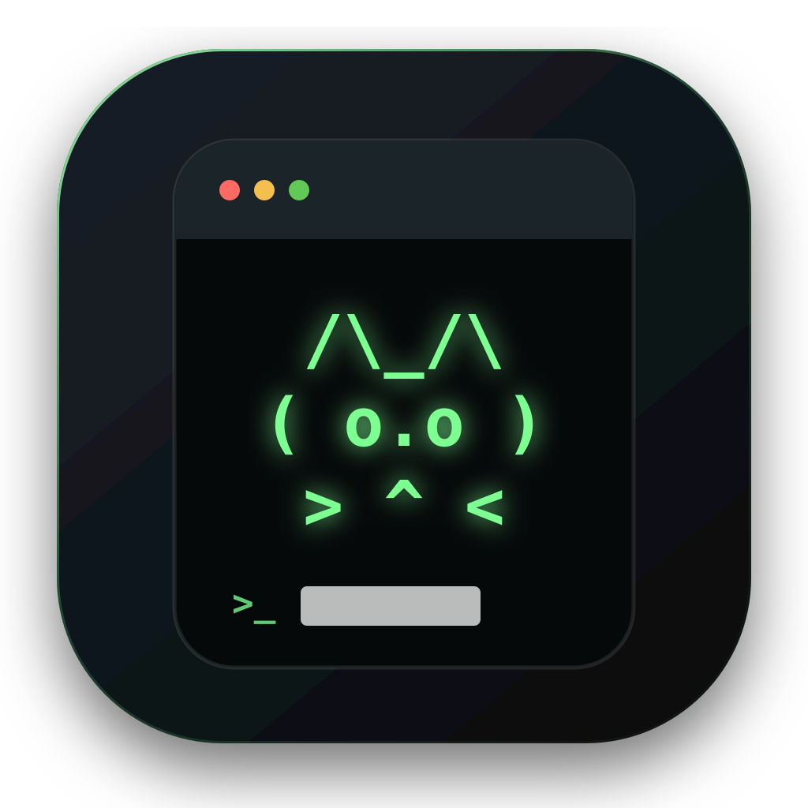
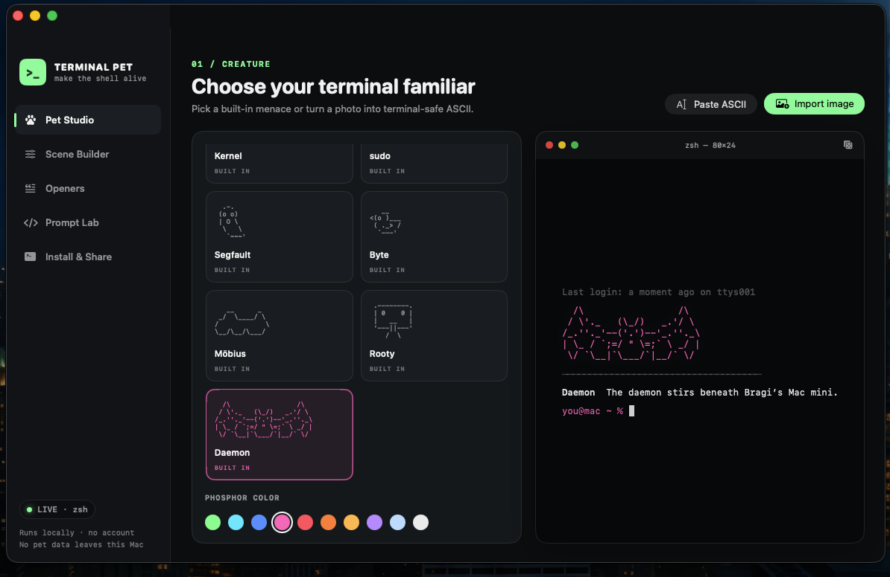
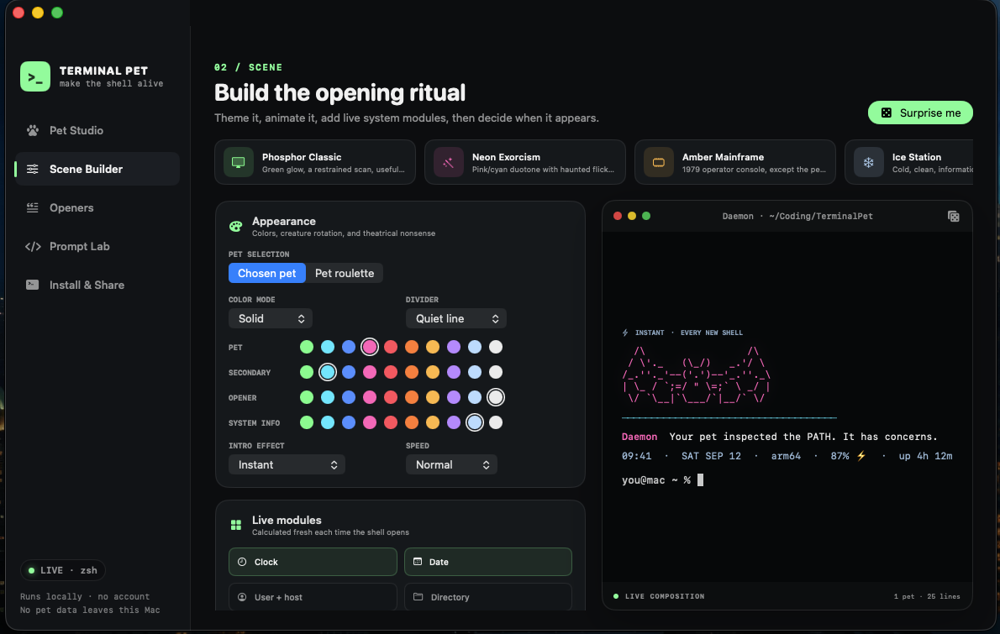
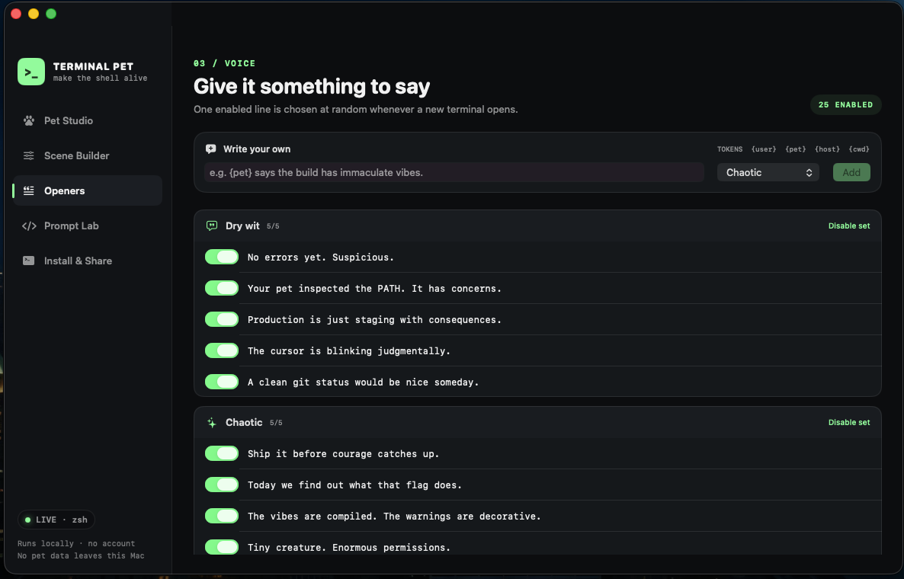

<p align="center">
  
</p>

<h1 align="center">Terminal Pet</h1>

<p align="center"><strong>A tiny creature. An unreasonable amount of terminal personality.</strong></p>
<p align="center">Native macOS app · zsh &amp; Bash · Version 0.2.0 · MIT licensed</p>

A native macOS terminal-identity workshop: summon an ASCII familiar, compose a live startup scene, and optionally rebuild the prompt that follows it.

Pick a pet, turn an image into ASCII, dial in the colors and effects, and let a tiny gremlin greet you with “No errors yet. Suspicious.”

## Video

[](https://www.youtube.com/watch?v=erN2ZfQj5cM)

[Watch on YouTube](https://www.youtube.com/watch?v=erN2ZfQj5cM).

## Creature studio

- Includes seven built-in pets: cat, dog, ghost, duck, worm, robot, and bat.
- Converts a local image into adjustable ASCII with four glyph palettes, contrast, inversion, flat-background removal, and width controls—or lets you paste and draw raw ASCII directly.
- Runs one chosen pet or a configurable pet-roulette pool.

| Familiar | Creature |
| --- | --- |
| Kernel | Cat |
| sudo | Dog |
| Segfault | Ghost |
| Byte | Duck |
| Möbius | Worm |
| Rooty | Robot |
| Daemon | Bat |

## Startup scene builder

- Includes eight presets, from Phosphor Classic and Amber Mainframe to Neon Exorcism and Chaos Engine.
- Offers solid, duotone, and per-line rainbow rendering; ten ANSI colors; six divider styles; and five intro effects at three speeds.
- Includes 25 dry, chaotic, hype, cozy, and machine-spirit openers.
- Supports custom lines and live tokens: `{user}`, `{pet}`, `{host}`, and `{cwd}`.
- Adds live clock, date, user/host, directory, macOS version, architecture, shell, battery, uptime, and git-branch modules.
- Controls frequency, local/SSH scope, IDE-terminal exclusion, quiet hours, `NO_COLOR`, window titles, and the terminal bell.



### A voice for your terminal

Choose the lines your pet can say, toggle an entire mood, or write your own with live tokens.



## Prompt Lab

- Optionally installs a dynamic minimal, two-line, capsule, or operator prompt for zsh and Bash.
- Composes time, user/host, directory, git branch, and exit status segments with configurable colors and symbols.
- Can make the pet react to failed commands. Enabling Prompt Lab intentionally replaces the visible prompt from other prompt frameworks; disabling it leaves those frameworks alone.

## Install and share

- Installs into zsh, bash, or both; updates and uninstalls cleanly.
- Exports and imports the complete setup as readable JSON.
- Runs entirely on-device. There is no account, upload, analytics, or resident background process.

## Build it on a Mac

Requirements: **macOS 13 Ventura or newer** and **Swift 5.9 or newer**, supplied by Apple's Command Line Tools or Xcode. The app builds for the Mac you're using.

1. [Download the source ZIP](https://github.com/BragiHelvig/terminalpet/archive/refs/heads/main.zip), extract it, and double-click `BUILD_TERMINAL_PET.command`.
2. If macOS asks, allow the Command Line Tools installation, wait for it to finish, then run the builder again.
3. The finished app opens automatically and remains in `dist/Terminal Pet.app`. Drag it to Applications if you want.

Or from Terminal:

```zsh
git clone https://github.com/BragiHelvig/terminalpet.git
cd terminalpet
./BUILD_TERMINAL_PET.command
```

If the extracted builder needs executable permission, run this from the project folder:

```zsh
chmod +x BUILD_TERMINAL_PET.command
./BUILD_TERMINAL_PET.command
```

If macOS blocks a downloaded copy, review and allow it in **System Settings → Privacy & Security**, then run it again. No administrator privileges are needed for the build or Terminal Pet's shell installation.

## Your first summon

1. Open **Pet Studio** and choose a familiar or import your own.
2. Use **Scene Builder** to pick a preset and tune its colors, effects, and live modules.
3. Choose your **Openers** and optionally customize **Prompt Lab**.
4. In **Install & Share**, select zsh, Bash, or both and install.
5. Open a new terminal window to meet your pet.

You can close the app after installation. The generated shell scripts handle the greeting and optional prompt. After changing prompt settings or uninstalling, open a fresh shell to load the new configuration.

## How installation works

The app generates `~/.terminal-pet/pet.sh` plus optional `prompt.zsh` and `prompt.bash` files, then adds one marked block to zsh or Bash startup files. For Bash it covers both interactive and macOS login-shell launches, with guards that prevent duplicate output. Before its first edit, it saves the existing file beside it with `.pre-terminal-pet` appended. The startup scene exits unless its output is an interactive TTY.

Uninstall removes Terminal Pet's marked blocks and generated files while keeping the rest of your shell configuration. Your pre-install backups remain available.

The app is deliberately not sandboxed because a sandboxed app cannot update your shell startup file directly. It is ad-hoc signed during the local build and contains no network code. Ad-hoc signing is not Apple Developer ID signing or notarization.

## Development

This is a Swift Package with a SwiftUI/AppKit front end and no external package dependencies. Build from source with:

```zsh
swift build
swift run TerminalPet
```

The production builder creates a conventional `.app` bundle and ad-hoc signs it.

## License

[MIT](LICENSE) · Copyright © 2026 Bragi Allen Helvig.
